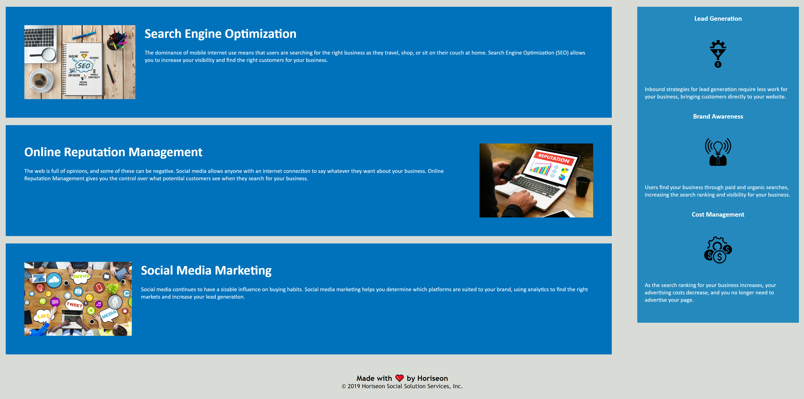

# Horiseon Refactor

## Purpose of the Assignment
We were contacted by Horiseon Social Solution Services, Inc to review the code for their website. We were asked to comb through the code and make sure all links were functioning properly and the code was optimized for accessibility and screen readers. In addition we were asked to streamline the code to ensure the index and style sheets followed the correct order and organization. Lastly, we reviewed the CSS code to simplify the styling rules and consolidate any excessive rules.

## Changes Made
I started by reviewing the functions of the website to determine which aspects were links and whether the links were all functioning correctly. I determined the links were the within the navigation section of the header. All links were functioning except the "Search Engine Optimization". The links are used to take the user down to the content of the section selected. While reviewing the code I found the div for the link had a class listed but did not include the id. After adding the proper id and confirming it matched the a href the link functioned properly. 

With the link functioning properly I reviewed the rest of the html code for semantic elements. Starting from the top I worked my way down and ensured the code was structured with a header, sections, and a footer. Once the semantic elements were in place I added a descriptive title to the head section. At that point I reviewed the header lines to ensure they were in proper order starting with H1 through H3. H1 was used for the company's name in the header. H2 was used for the titles of the content sections with H3 used to distinguish the benefits.

With the HTML code complete I turned my attention to the CSS sheet where I found identical rules written for similar classes one by one. I combined them and separated the classes using commas. I found the order of the css rules did not follow the same order as the html sheet. To make it easier to find the cooresponding rules for the html sections I reorganized the css rules to follow the same order. I then added comments to describe the sections of the css sheet to make it easy to navigate. 

## Installation
No special installation steps are required. Website functions as intended.

## Usage
Website can be found at [GitHub Page](https://alexcourtney18.github.io/Horiseon-Refactor/)

Screenshots of the website:

## Credits
Starting code was provided by Horiseon Social Solutions, Inc. 

# License
All licenses belong to Horiseon Social Solutions, Inc.

# Tests
To test content, click the links in the navigation section within the header. Links will take you to the described section of the content.